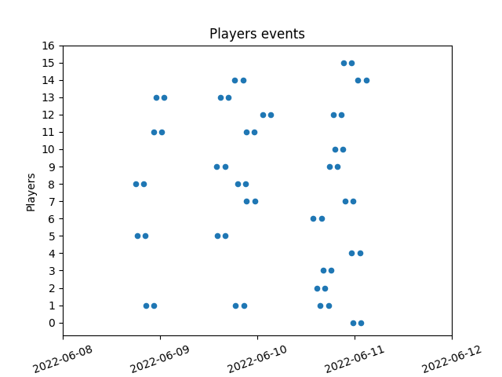

# Players Behaviors Dataset Generator

This project provides a tool to synthetize game dataset to be used in Analytics and Machine Learning examples and demos.

## Install

'pbdg' is a python package available at https://pypi.org/project/players-behaviors-dataset-generator/

```
pip install players-behaviors-dataset-generator
```

## Basic usage

#### Help

```
pbdg --help
```

#### Version

```
pbdg --version
```

## Generate game events

Events are triggered by players activity. They come from different parts/systems of the game such as the client, the servers for multi-player games or services/backend.

The most important events are the one indicating that a player is starting playing to the game. It is also interesting to know when a player is stopping playing the game, but those events are trickier to catch as the user will rarely stop the game explicitly, he is just stop playing.

The tool is generating 2 main types of events BEGIN_SESSION and END_SESSION. From those events one can deduced sessions duration, frequencies and more. The command is not generating other events at that time.

In the real world, a game company will invest some money in advertising to acquire player. The tool is simulating a players acquisition campaign by adding daily new players. This parameter can be controlled with the --players option. You can also control the acquisition campaign duration by specifying the number of days it should last with the --days option. By default the tool is using the current date as the acquisition campaign staring date, but you can change that with the --date option.

### Help

```
pbdg events --help
```

```
Usage: pbdg events [OPTIONS] [FILENAME]

  Generate game events of types (BEGIN_SESSION,END_SESSION) with fields
  (id,player_id,player_type,cohort_id,session_id,event_type,timestamp) in a
  specified csv filename (default=events).

Options:
  --date [%Y-%m-%d]     The players acquisition starting date (default=today)
  --players INTEGER     The number of daily acquired players (default=10)
  --days INTEGER        The number of acquisition days (default=7)
  --seed INTEGER        The random seed (default=0)
  --plot / --no-plot    The plot flag (default=False)
  --debug / --no-debug  The debug flag (default=False)
  --help                Show this message and exit.
```

### Example

```
pbdg events --days 7 --players 10 --plot
```
```
generating events: |██████████████████████████████████████████████████| 100.0% 
storing events...
events stored in events.csv!
plot events...
events plotted in events.png!
```

Generated file content ():

| id | cohort_id | player_id | player_type | session_id | event_type | timestamp |
|----|-----------|-----------|-------------|------------|------------|-----------|
| cb1d693fa7794f0bbef896ed6580b450 | b9d89fd8acf6407aadd9ad1df25848ba | 35e9daaa543c41d387c2c3ae819111ab | churner | 9584da9c2c1f45499e9ae3fea62f3a92 | BEGIN_SESSION | 2022-06-07 14:03:19.442741 |
| 6e0165112e3f4474ad65c573ec34152a | b9d89fd8acf6407aadd9ad1df25848ba | 35e9daaa543c41d387c2c3ae819111ab | churner | 9584da9c2c1f45499e9ae3fea62f3a92 | END_SESSION | 2022-06-07 16:03:36.737366 |
| 1ed1ea35f28645b7ab8ae589c6840bc5 | b9d89fd8acf6407aadd9ad1df25848ba | 949205af41584d8db32e707cbd4d6572 | churner | 119b2195a8b44975a7452882b7c6fb51 | BEGIN_SESSION | 2022-06-07 16:13:32.484385 |
| 3be45075c9224d25b69456c81d0a6810 | b9d89fd8acf6407aadd9ad1df25848ba | c944cc7aaa864a99b8d19aca2bb6da55 | churner | e2c3f1e5a3414019a672d3bc16269207 | BEGIN_SESSION | 2022-06-07 17:57:39.083961 |
| edb71963891d4366af41b2b203789c2d | b9d89fd8acf6407aadd9ad1df25848ba | 949205af41584d8db32e707cbd4d6572 | churner | 119b2195a8b44975a7452882b7c6fb51 | END_SESSION | 2022-06-07 18:14:05.617585 |
| ... | ... | ... | ... | ... | ... | ... |

Generated diagram (events.png):



## Generate game metrics from game events

***Not yet implemented.***

We want to compute the following metrics:
- Daily Active Users (DAU)
- Monthly Active Users (MAU)
- Daily game connection number
- Average game connection duration
- Daily game session number
- Retention D1/D2/D3/D4/D5/6/D7/D14/D28
- Average game session duration
- ARPU (Average Revenue Per User)
- ARPDAU (Average Revenue Per Daily User)
- ARPPU (Average Revenue Per Paying User)

## Generate machine learning features from game events

Features are data extracted from the game events that could be useful to solve a business problem with a machine learnig algorithm.

In free-2-play games you may want to game studios would like to predict when a player will churn, predict player type, forecast revenue and many more.
Machine learning can help to solve those problems but we need to extract the right data aka features from game events to make the algorithm works on the feature dataset.

***Players churn prediction:***

Retention is a key metric in games and more specifically for free 2 play games. The longer your players are playing your game the more you will monetize it.
Therefore, predicting player churn is a key advantage. The eralier you can predict hurn the faster you will be able to tailor made your marketing action to keep your player engaged. 

***Players segmentation:***

Identifying the various personas in your player base is also critical to operate your game. You may want to identify big spenders but also socializer competiters and improve your gameplay with personnalized offers to keep them engaged.

***Players spend and revenue forecast:***

In the end your game is also a business and you need to have higher revenues than expenses. Beeing able to forecast your revenue based on your players behaviour is a strategic piece of information to adjust your advertizing, marketing or infrastructure expenses to keep your business profitable.

### Features

***Cohort id:*** 
Player acquisition is made on a daily basis. A acquisition cohort is the group of players acquired in the same advertizing campaign. Each day beeing different, the capacity to analyze player behaviour withing a cohort is valuable as each member have been acquired in the same conditions and different behaviours are most likely driven by the same causes. The game events already have a cohort_id generated by the ```events``` command. In real life, events are generated by independant systems, so the cohort id is computed when the event is received os analyzed. The ```features``` command is computing the cohort id simply by keeping the year_month_day of the first received event from a player.

***Cohort day of week***: Players may have different behaviours depending on the day they have been acquired.

***Player churn***: A player is considered as churn after a defined inactivity period. The tool is using 5 days after the last receieved event date. This period can be adjusted wth the --churn-days option

***Player lifetime***: The player lifetime is the duration between the first received event and the last wether the player has churn or not.

***Session count***: The total number of sessions played by the player.

***Sampling features***: Game events are time series. Some machine learing algorithms are able to use time series as input such as LSTM or DeepAR. Nevertheless, the vast majority still need some engineering to integrate the time component into the features data set. More over, some prediction tasks are more sentitive to recent temporal changes in players behaviours than very old events. 

The tool is offering a sampling techniques that is group events values by time periods with various granularity: minutes, hours, days, weeks and months. This will allow the feature dataset to capture temporal changes without the cost of keeping all events at very fine grained granularity. 

The tool is currently sampling 3 values from events : 
* count: event count 
* time_of_day_mean: event average timestamp in seconds mesured relatively to the current day
* time_of_day_std: event average standard deviation in seconds mesured relatively to the current day

### Help

```
pbdg features --help
```
```
Usage: pbdg features [OPTIONS] [FILENAME]

  Generate machine learning features (cohort_id,cohort_day_of_week,player_id,p
  layer_type,player_lifetime,player_churn,session_count,last_minute,last_hour,
  last_day,last_week,last_month) with variants
  (count,time_of_day_mean,time_of_day_std) for each event type
  (BEGIN_SESSION,END_SESSION) in a specified csv file name (default=features)

Options:
  --churn-days INTEGER    The number of inactivity days to be flagged as churn
                          (default=5)
  --last-minutes INTEGER  The number of minutes to sample before last event
                          date (default=0)
  --last-hours INTEGER    The number of hours to sample before last event date
                          (default=0)
  --last-days INTEGER     The number of days to sample before last event date
                          (default=7)
  --last-weeks INTEGER    The number of minutes to sample before last event
                          date (default=3)
  --last-months INTEGER   The number of months to sample before last event
                          date (default=2)
  --events TEXT           The csv filename of the input game events
                          (default=events)
  --seed INTEGER          The random seed (default=0)
  --debug / --no-debug    The debug flag (default=False)
  --help                  Show this message and exit.
```

### Example

```
pbdg features --churn-days 3 --last-days 10
```
```
loading events...
events loaded!
generating features: |██████████████████████████████████████████████████| 100.0% 
storing features...
features stored in features.csv!
```

Generated file content ():

| player_id | cohort_id | cohort_day_of_week | player_type | player_lifetime | session_count | player_churn | begin_session_count_last_day(-1) | end_session_count_last_day(-1) | begin_session_count_last_day(-2) | end_session_count_last_day(-2) | begin_session_count_last_day(-3) | end_session_count_last_day(-3) | begin_session_count_last_day(-4) | end_session_count_last_day(-4) | begin_session_count_last_day(-5) | end_session_count_last_day(-5) | begin_session_count_last_day(-6) | end_session_count_last_day(-6) | begin_session_count_last_day(-7) | end_session_count_last_day(-7) | begin_session_count_last_day(-8) | end_session_count_last_day(-8) | begin_session_count_last_day(-9) | end_session_count_last_day(-9) | begin_session_count_last_day(-10) | end_session_count_last_day(-10) | begin_session_count_last_week(-1) | end_session_count_last_week(-1) | begin_session_count_last_week(-2) | end_session_count_last_week(-2) | begin_session_count_last_week(-3) | end_session_count_last_week(-3) | begin_session_count_last_month(-1) | end_session_count_last_month(-1) | begin_session_count_last_month(-2) | end_session_count_last_month(-2) | begin_session_time_of_day_mean_last_day(-1) | end_session_time_of_day_mean_last_day(-1) | begin_session_time_of_day_mean_last_day(-2) | end_session_time_of_day_mean_last_day(-2) | begin_session_time_of_day_mean_last_day(-3) | end_session_time_of_day_mean_last_day(-3) | begin_session_time_of_day_mean_last_day(-4) | end_session_time_of_day_mean_last_day(-4) | begin_session_time_of_day_mean_last_day(-5) | end_session_time_of_day_mean_last_day(-5) | begin_session_time_of_day_mean_last_day(-6) | end_session_time_of_day_mean_last_day(-6) | begin_session_time_of_day_mean_last_day(-7) | end_session_time_of_day_mean_last_day(-7) | begin_session_time_of_day_mean_last_day(-8) | end_session_time_of_day_mean_last_day(-8) | begin_session_time_of_day_mean_last_day(-9) | end_session_time_of_day_mean_last_day(-9) | begin_session_time_of_day_mean_last_day(-10) | end_session_time_of_day_mean_last_day(-10) | begin_session_time_of_day_mean_last_week(-1) | end_session_time_of_day_mean_last_week(-1) | begin_session_time_of_day_mean_last_week(-2) | end_session_time_of_day_mean_last_week(-2) | begin_session_time_of_day_mean_last_week(-3) | end_session_time_of_day_mean_last_week(-3) | begin_session_time_of_day_mean_last_month(-1) | end_session_time_of_day_mean_last_month(-1) | begin_session_time_of_day_mean_last_month(-2) | end_session_time_of_day_mean_last_month(-2) | begin_session_time_of_day_std_last_day(-1) | end_session_time_of_day_std_last_day(-1) | begin_session_time_of_day_std_last_day(-2) | end_session_time_of_day_std_last_day(-2) | begin_session_time_of_day_std_last_day(-3) | end_session_time_of_day_std_last_day(-3) | begin_session_time_of_day_std_last_day(-4) | end_session_time_of_day_std_last_day(-4) | begin_session_time_of_day_std_last_day(-5) | end_session_time_of_day_std_last_day(-5) | begin_session_time_of_day_std_last_day(-6) | end_session_time_of_day_std_last_day(-6) | begin_session_time_of_day_std_last_day(-7) | end_session_time_of_day_std_last_day(-7) | begin_session_time_of_day_std_last_day(-8) | end_session_time_of_day_std_last_day(-8) | begin_session_time_of_day_std_last_day(-9) | end_session_time_of_day_std_last_day(-9) | begin_session_time_of_day_std_last_day(-10) | end_session_time_of_day_std_last_day(-10) | begin_session_time_of_day_std_last_week(-1) | end_session_time_of_day_std_last_week(-1) | begin_session_time_of_day_std_last_week(-2) | end_session_time_of_day_std_last_week(-2) | begin_session_time_of_day_std_last_week(-3) | end_session_time_of_day_std_last_week(-3) | begin_session_time_of_day_std_last_month(-1) | end_session_time_of_day_std_last_month(-1) | begin_session_time_of_day_std_last_month(-2) | end_session_time_of_day_std_last_month(-2) |
|---|---|---|---|---|---|---|---|---|---|---|---|---|---|---|---|---|---|---|---|---|---|---|---|---|---|---|---|---|---|---|---|---|---|---|---|---|---|---|---|---|---|---|---|---|---|---|---|---|---|---|---|---|---|---|---|---|---|---|---|---|---|---|---|---|---|---|---|---|---|---|---|---|---|---|---|---|---|---|---|---|---|---|---|---|---|---|---|---|---|---|---|---|---|---|---|---|
| 97cea075a9954326bb0c71b31fcab437 | 2022_06_08 | 2 | churner | 97891.783281 | 2 | False | 1 | 1 | 1 | 1 | 0 | 0 | 0 | 0 | 0 | 0 | 0 | 0 | 0 | 0 | 0 | 0 | 0 | 0 | 0 | 0 | 2 | 2 | 0 | 0 | 0 | 0 | 2 | 2 | 0 | 0 | 69078.272027 | 76150.867241 | 64659.083961 | 71881.314174 | 0 | 0 | 0 | 0 | 0 | 0 | 0 | 0 | 0 | 0 | 0 | 0 | 0 | 0 | 0 | 0 | 23668.677994 | 30816.090708 | 0 | 0 | 0 | 0 | 23668.677994 | 30816.090708 | 0 | 0 |  |  |  |  | 0 | 0 | 0 | 0 | 0 | 0 | 0 | 0 | 0 | 0 | 0 | 0 | 0 | 0 | 0 | 0 | 64218.863743 | 64113.05582 | 0 | 0 | 0 | 0 | 64218.863743 | 64113.05582 | 0 | 0 |
| 56d4b533b42740e990ce0aac3bdfcfc6 | 2022_06_08 | 2 | churner | 78252.746837 | 2 | False | 2 | 2 | 0 | 0 | 0 | 0 | 0 | 0 | 0 | 0 | 0 | 0 | 0 | 0 | 0 | 0 | 0 | 0 | 0 | 0 | 2 | 2 | 0 | 0 | 0 | 0 | 2 | 2 | 0 | 0 | 15081.716635 | 22274.939247 | 0.0 | 0.0 | 0 | 0 | 0 | 0 | 0 | 0 | 0 | 0 | 0 | 0 | 0 | 0 | 0 | 0 | 0 | 0 | 15081.716635 | 22274.939247 | 0 | 0 | 0 | 0 | 15081.716635 | 22274.939247 | 0 | 0 | 50229.649963 | 50263.69293 | 0.0 | 0.0 | 0 | 0 | 0 | 0 | 0 | 0 | 0 | 0 | 0 | 0 | 0 | 0 | 0 | 0 | 0 | 0 | 50229.649963 | 50263.69293 | 0 | 0 | 0 | 0 | 50229.649963 | 50263.69293 | 0 | 0 |
| 16ca20d622c04f96971ac359cd8f4151 | 2022_06_08 | 2 | churner | 161992.623939 | 3 | False | 2 | 2 | 1 | 1 | 0 | 0 | 0 | 0 | 0 | 0 | 0 | 0 | 0 | 0 | 0 | 0 | 0 | 0 | 0 | 0 | 3 | 3 | 0 | 0 | 0 | 0 | 3 | 3 | 0 | 0 | 18328.872222 | 25516.40685 | 73935.322063 | 81085.45611 | 0 | 0 | 0 | 0 | 0 | 0 | 0 | 0 | 0 | 0 | 0 | 0 | 0 | 0 | 0 | 0 | 65664.355502 | 72839.42327 | 0 | 0 | 0 | 0 | 65664.355502 | 72839.42327 | 0 | 0 | 53215.18547 | 53190.74877 |  |  | 0 | 0 | 0 | 0 | 0 | 0 | 0 | 0 | 0 | 0 | 0 | 0 | 0 | 0 | 0 | 0 | 77421.168823 | 77431.646079 | 0 | 0 | 0 | 0 | 77421.168823 | 77431.646079 | 0 | 0 |
| e14c495dc6544134bd51e7eb7bfd91f4 | 2022_06_08 | 2 | churner | 89544.033403 | 2 | False | 1 | 2 | 1 | 0 | 0 | 0 | 0 | 0 | 0 | 0 | 0 | 0 | 0 | 0 | 0 | 0 | 0 | 0 | 0 | 0 | 2 | 2 | 0 | 0 | 0 | 0 | 2 | 2 | 0 | 0 | 76617.072141 | 42513.73832 | 80601.831075 | 0.0 | 0 | 0 | 0 | 0 | 0 | 0 | 0 | 0 | 0 | 0 | 0 | 0 | 0 | 0 | 0 | 0 | 35409.451608 | 42513.73832 | 0 | 0 | 0 | 0 | 35409.451608 | 42513.73832 | 0 | 0 |  | 58311.032016 |  | 0.0 | 0 | 0 | 0 | 0 | 0 | 0 | 0 | 0 | 0 | 0 | 0 | 0 | 0 | 0 | 0 | 0 | 58276.37583 | 58311.032016 | 0 | 0 | 0 | 0 | 58276.37583 | 58311.032016 | 0 | 0 |

## Security

See [CONTRIBUTING](CONTRIBUTING.md#security-issue-notifications) for more information.

## License

This library is licensed under the MIT-0 License. See the [LICENSE](LICENSE) file.